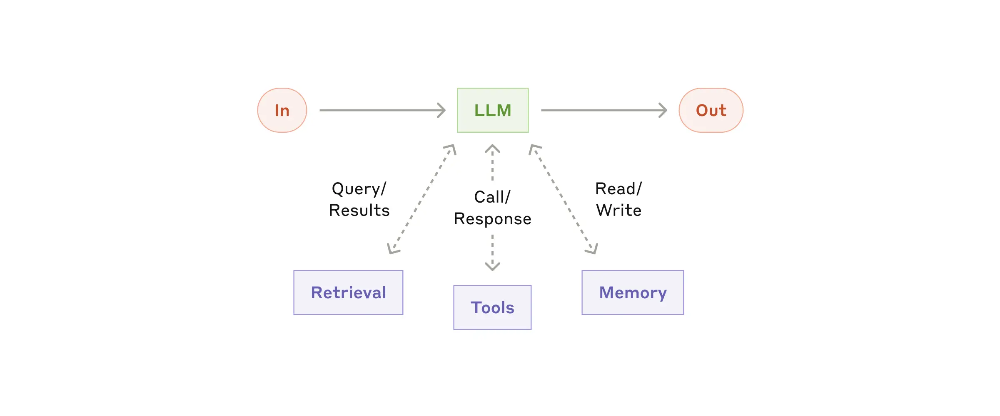
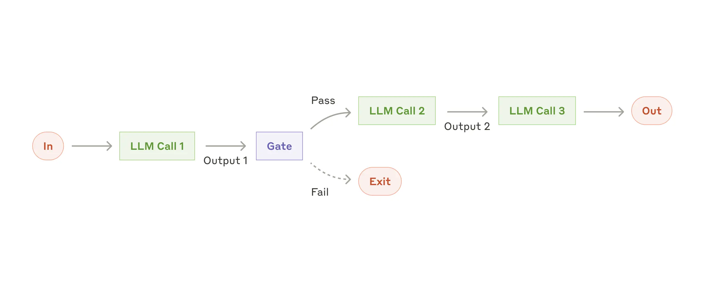
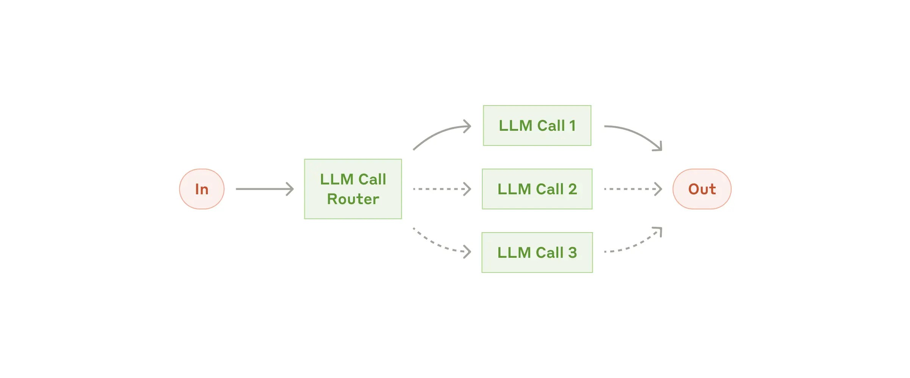
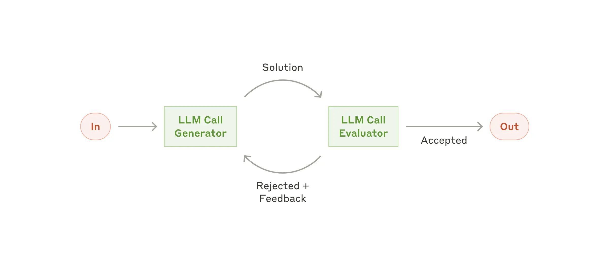
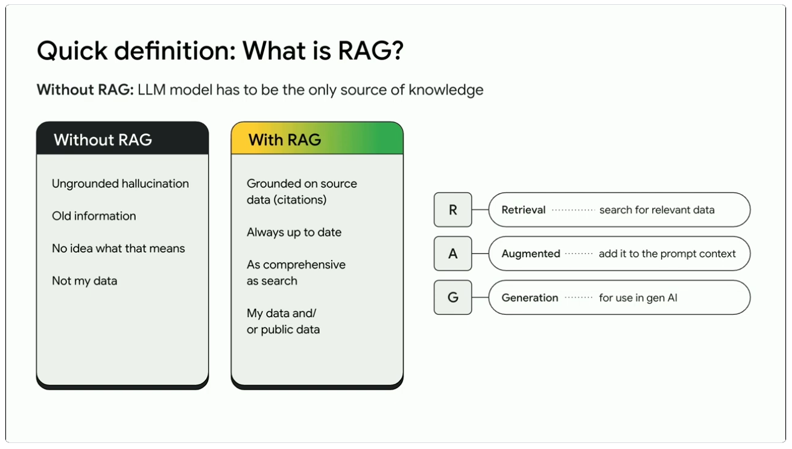
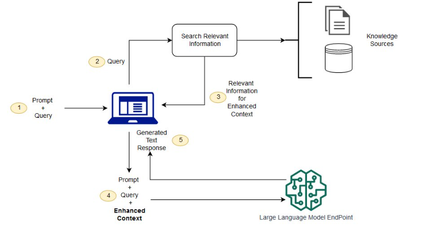

### What is AI Agents ?
Basic building block of agentic is; 
- its ability to use LLM to augment the retrival from input, 
- process them using a tool and them store the state using memory 
- and finally provide the output based on the input.

AI Agents are programs where LLM outputs control the workflow

1. Multiple LLM calls
2. LLM with ability to use tools
3. An environment where LLMs interact 
4. A Planner to coordinate activities
5. Autonomy 

Reference - Anthropic Guide for Agentic - https://www.anthropic.com/engineering/building-effective-agents

### Key Agentic Concepts

- Agents
- Workflows 
- Frameworks
- Resources
- Tools

### Workflows - What are Different Types 
#### Chaining Workflow
  - Here each input goes through a LLM call then we will have a backend check to validate its on track and direct it to next step
  - This can be used when task can be easily decomposed into fixed sub-tasks, more like if then conditions  

#### Routing Workflow - 
- Routing classifies an input and direct it to a specialized followup task
- This workflow allows more seperation of concerns and building more specialized prompts.
- Without optimizing this routing input for one workflow can hurt others 

#### Workflow Parallelization 
- Here it can execute multple workflows in parallel and aggregates their input into one.
- This comes with two main sub strem process 
  - sectioning - Breaking down one single task into multiple sub-tasks
  - voting - Running same tasks multiple times to get diverse outputs 
- Parallelization is effective when the divided subtasks can be parallelized for speed, or when multiple perspectives or attempts are needed for higher confidence results.
  

#### Workflow Orchestrator
- In this concept a central LLL dynamically breakdown tasks into multiple and then delegates into multiple LLMs
- Then these multiple LLMs process the individual workflows assigned to them 
- Finally all output will be synchorized by another LLM 

#### Evaluator and Optimizer 
- In this architecture one LLM creates responses 
- Another one repeatedly evaluates the response being created 
- A very good use case while writing white papers

### Why Agents 
- Agents can be used for open-ended problems, where there is no binary decission needed or no definite answer yet.
- This will be idle when we do not know definite number of steps required or definite path
- During execution agents take input from human and ask for further clarification 
- Then while reasoning it gains more facts from the enviroments its connecting like documents or tools 
- Once the task is clear it operates indipendatly and provide desired results 

Below is sample workflow of a coding agent
 

### Agentic Frameworks

There are several AI frameworks available for you to pick depends on your use cases, they are listed below based on their level of **complexity** from easier (1) to complex (6).

1. No Framework & use your own glue code
2. [MCP (Model Context Protocol)](https://modelcontextprotocol.io/docs/getting-started/intro)
3. [Crew AI](https://docs.crewai.com/en/introduction)
4. [OpenAI Agents SDK](https://developers.openai.com/api/docs/guides/agents-sdk)
5. [Microsoft - AutoGen](https://www.microsoft.com/en-us/research/project/autogen/)
6. [LangGraph](https://docs.langchain.com/oss/python/langgraph/overview?_gl=1*1vsol4*_gcl_au*MjEwMjIxMjk4Ni4xNzc2MTc3MDcx*_ga*NDY2MTA2NjI0LjE3NzYxNzcwNzI.*_ga_47WX3HKKY2*czE3NzYxNzcwNzIkbzEkZzEkdDE3NzYxNzcwODAkajUyJGwwJGgw)

### Improving the expertise of LLMs

#### LLM Resources

Resources provide ability for LLM to read additional data sources which will help to provide  additional context to the response LLM is already providing.  

#### LLM RAG (Retrieval Augmented Generation)

Retrieval Augmented Generation (RAG) is a technique used to make the LLM response in right latest context by bringing additional data sources while processing the request. 
This is done  by using a technique called **grounding** which brings in all additional data into LLM context for response.  
Couple examples for this use case is
- News Feeds from LLM
- Corporate Knowledgebase integration with LLM for internal chatbots

Below table explains with and without RAG how it works 

Below is a sample RAG architecture 

Sample code : https://github.com/ajay291491/LearnAgentic/tree/main/ConceptCodes/LLMRAGAugmentation

##### How does Retrieval-Augmented Generation work?
RAGs operate with a few main steps to help enhance generative AI outputs:
- Retrieval and pre-processing: RAGs leverage powerful search algorithms to query external data, such as web pages, knowledge bases, and databases. Once retrieved, the relevant information undergoes pre-processing, including tokenization, stemming, and removal of stop words.
- Grounded generation: The pre-processed retrieved information is then seamlessly incorporated into the pre-trained LLM. This integration enhances the LLM's context, providing it with a more comprehensive understanding of the topic. This augmented context enables the LLM to generate more precise, informative, and engaging responses.

Reference 
- https://cloud.google.com/use-cases/retrieval-augmented-generation?hl=en
- https://aws.amazon.com/what-is/retrieval-augmented-generation/

#### LLM Tools

LLM Tools enable LLMs to take real world actions by connecting to tools. This solves the problem of LLMs to deal with real time data and take actions such as 

- Write to a database 
- Call a weather API to return the weather for a place.
- etc 

Reference
- https://vercel.com/kb/guide/what-is-an-llm-tool

Sample Code : https://github.com/ajay291491/LearnAgentic/tree/main/ConceptCodes/LLMToolCalling

#### LLM Prompting
Prompting is the process of designing and structuring the input given to a language model (LLM) to elicit a desired response. Effective prompting can significantly enhance the quality and relevance of the output.
There are mainly 2 types of prompting techniques
- system prompting - This is used to set the behavior of the LLM, it can be used to set the tone, style, or even the role of the LLM in the conversation. For example, you can use system prompting to make the LLM respond in a formal tone or to act as a specific character.
- user prompting - This is used to provide specific instructions or information to the LLM to guide its response. For example, you can use user prompting to ask a question, provide context, or specify the format of the response.

##### Prompting Techniques
- **Zero-shot prompting**: This is where you provide a prompt without any examples, and the LLM generates a response based solely on its pre-trained knowledge. For example, you might ask, "What is the capital of France?" and the LLM would respond with "Paris."
- **Few-shot prompting**: This is where you provide a prompt along with a few examples to guide the LLM's response. For example, you might ask, "What is the capital of France? The capital of Germany is Berlin. The capital of Italy is Rome. What is the capital of France?" and the LLM would respond with "Paris."
- **Chain-of-thought prompting**: This is where you provide a prompt that encourages the LLM to think through the problem step by step. For example, you might ask, "What is the capital of France? First, let's think about the major cities in France. We have Paris, Lyon, and Marseille. Now, which one is the capital?" and the LLM would respond with "Paris."
- **Self-consistency prompting**: This is where you provide a prompt that encourages the LLM to generate multiple responses and then select the most consistent one. For example, you might ask, "What is the capital of France? Please provide three different answers and then select the most consistent one." The LLM might respond with "Paris, Lyon, Marseille. The most consistent answer is Paris."
- **Prompt engineering**: This is the process of designing and structuring prompts to elicit specific responses from the LLM. It involves understanding the capabilities and limitations of the LLM and crafting prompts that maximize its performance. For example, you might use prompt engineering to create a prompt that encourages the LLM to generate creative writing or to provide detailed explanations.

##### Tuning Techniques
- **Prompt tuning**: This is the process of fine-tuning the LLM on specific prompts to improve its performance on those prompts. It involves training the LLM on a dataset of prompts and responses to help it learn how to generate better responses for those prompts. For example, you might use prompt tuning to improve the LLM's performance on a specific task, such as summarization or question answering.
- **Prompt optimization**: This is the process of systematically improving prompts to maximize the performance of the LLM. It involves using techniques such as A/B testing, reinforcement learning, and human feedback to optimize prompts for specific tasks or goals. For example, you might use prompt optimization to fine-tune a prompt for a customer service chatbot to improve its ability to handle common inquiries effectively.

Reference : https://cloud.google.com/discover/what-is-prompt-engineering?hl=en

