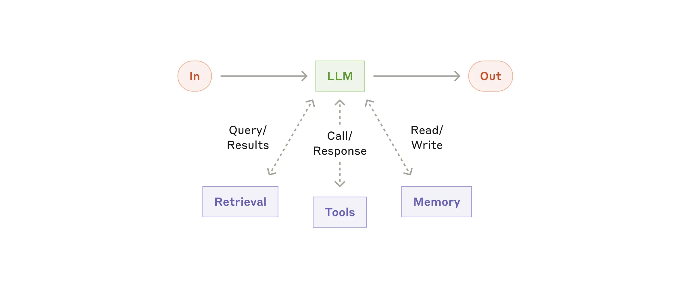
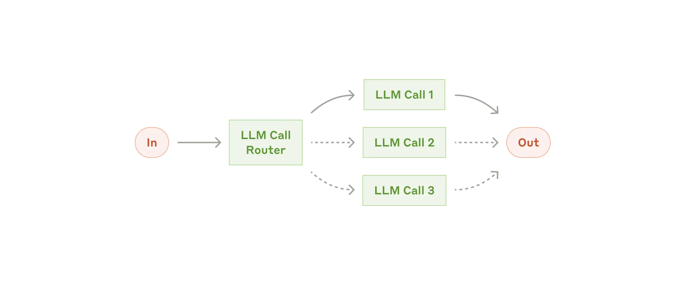
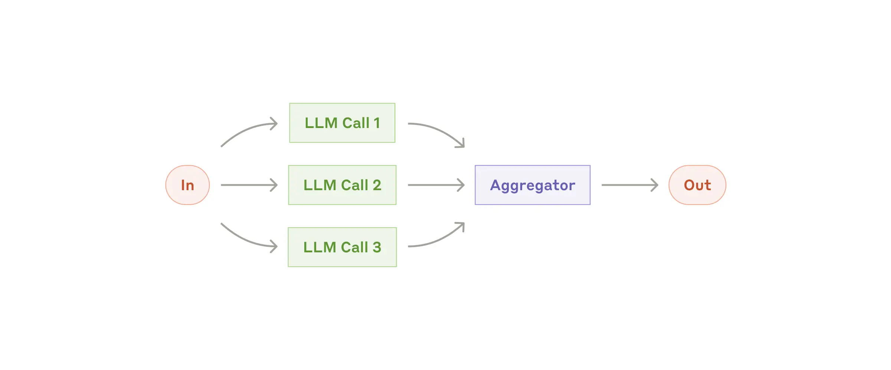
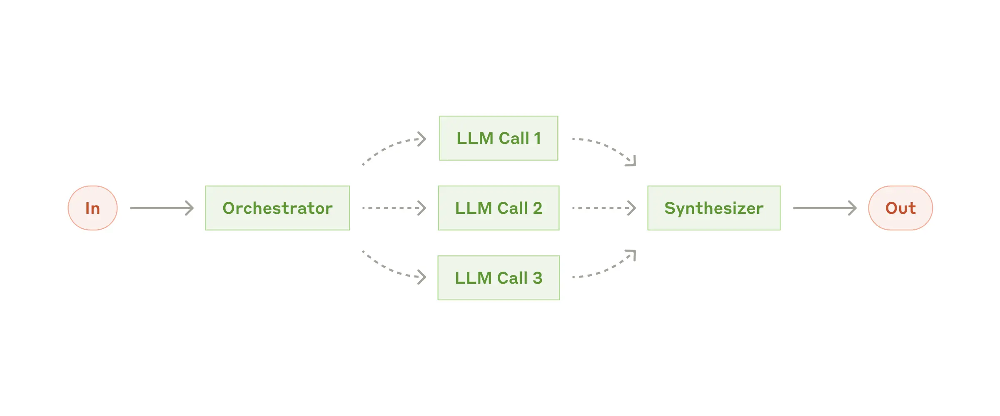
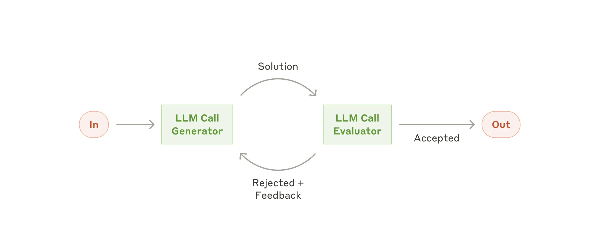
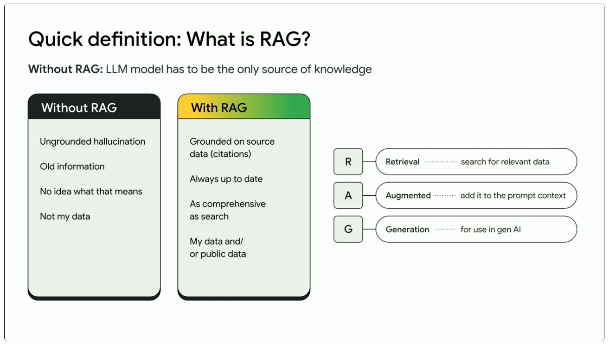
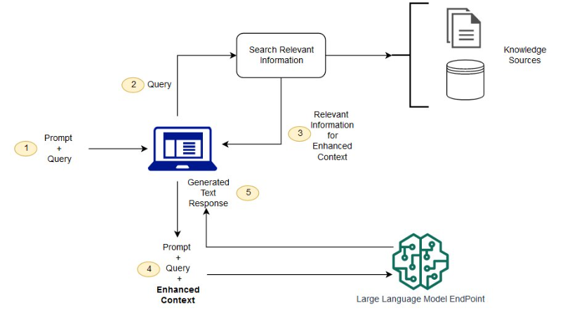

### Chapter 01 -  What is AI Agents ?
Basic building block of agentic is; 
- its ability to use LLM to augment the retrival from input, 
- process them using a tool and them store the state using memory 
- and finally provide the output based on the input.



AI Agents are programs where LLM outputs control the workflow

1. Multiple LLM calls
2. LLM with ability to use tools
3. An environment where LLMs interact 
4. A Planner to coordinate activities
5. Autonomy 

Reference - Anthropic Guide for Agentic - https://www.anthropic.com/engineering/building-effective-agents

### Key Agentic Concepts

- Agents
- Workflows 
- Frameworks
- Resources
- Tools

### Workflows - What are Different Types 
#### Chaining Workflow
  - Here each input goes through a LLM call then we will have a backend check to validate its on track and direct it to next step
  - This can be used when task can be easily decomposed into fixed sub-tasks, more like if then conditions  


#### Routing Workflow - 
- Routing classifies an input and direct it to a specialized followup task
- This workflow allows more seperation of concerns and building more specialized prompts.
- Without optimizing this routing input for one workflow can hurt others 


#### Workflow Parallelization 
- Here it can execute multple workflows in parallel and aggregates their input into one.
- This comes with two main sub strem process 
  - sectioning - Breaking down one single task into multiple sub-tasks
  - voting - Running same tasks multiple times to get diverse outputs 
- Parallelization is effective when the divided subtasks can be parallelized for speed, or when multiple perspectives or attempts are needed for higher confidence results.
  

#### Workflow Orchestrator
- In this concept a central LLL dynamically breakdown tasks into multiple and then delegates into multiple LLMs
- Then these multiple LLMs process the individual workflows assigned to them 
- Finally all output will be synchorized by another LLM 


#### Evaluator and Optimizer 
- In this architecture one LLM creates responses 
- Another one repeatedly evaluates the response being created 
- A very good use case while writing white papers




### Why Agents 
- Agents can be used for open-ended problems, where there is no binary decission needed or no definite answer yet.
- This will be idle when we do not know definite number of steps required or definite path
- During execution agents take input from human and ask for further clarification 
- Then while reasoning it gains more facts from the enviroments its connecting like documents or tools 
- Once the task is clear it operates indipendatly and provide desired results 


Below is sample workflow of a coding agent
 

### Agentic Frameworks

There are several AI frameworks available for you to pick depends on your use cases, they are listed below based on their level of **complexity** from easier (1) to complex (6).

1. No Framework & use your own glue code
2. [MCP (Model Context Protocol)](https://modelcontextprotocol.io/docs/getting-started/intro)
3. [Crew AI](https://docs.crewai.com/en/introduction)
4. [OpenAI Agents SDK](https://developers.openai.com/api/docs/guides/agents-sdk)
5. [Microsoft - AutoGen](https://www.microsoft.com/en-us/research/project/autogen/)
6. [LangGraph](https://docs.langchain.com/oss/python/langgraph/overview?_gl=1*1vsol4*_gcl_au*MjEwMjIxMjk4Ni4xNzc2MTc3MDcx*_ga*NDY2MTA2NjI0LjE3NzYxNzcwNzI.*_ga_47WX3HKKY2*czE3NzYxNzcwNzIkbzEkZzEkdDE3NzYxNzcwODAkajUyJGwwJGgw)

### Improving the expertise of LLMs

#### LLM Resources

Resources provide ability for LLM to read additional data sources which will help to provide  additional context to the response LLM is already providing.  

#### LLM RAG (Retrieval Augmented Generation)

Retrieval Augmented Generation (RAG) is a technique used to make the LLM response in right latest context by bringing additional data sources while processing the request. 
This is done  by using a technique called **grounding** which brings in all additional data into LLM context for response.  
Couple examples for this use case is
- News Feeds from LLM
- Corporate Knowledgebase integration with LLM for internal chatbots

Below table explains with and without RAG how it works 



Below is a sample RAG architecture 



Sample code : https://github.com/ajay291491/LearnAgentic/tree/main/ConceptCodes/LLMRAGAugmentation

##### How does Retrieval-Augmented Generation work?
RAGs operate with a few main steps to help enhance generative AI outputs:
- Retrieval and pre-processing: RAGs leverage powerful search algorithms to query external data, such as web pages, knowledge bases, and databases. Once retrieved, the relevant information undergoes pre-processing, including tokenization, stemming, and removal of stop words.
- Grounded generation: The pre-processed retrieved information is then seamlessly incorporated into the pre-trained LLM. This integration enhances the LLM's context, providing it with a more comprehensive understanding of the topic. This augmented context enables the LLM to generate more precise, informative, and engaging responses.

Reference 
- https://cloud.google.com/use-cases/retrieval-augmented-generation?hl=en
- https://aws.amazon.com/what-is/retrieval-augmented-generation/

#### LLM Tools

LLM Tools enable LLMs to take real world actions by connecting to tools. This solves the problem of LLMs to deal with real time data and take actions such as 

- Write to a database 
- Call a weather API to return the weather for a place.
- etc 

Reference   :  https://vercel.com/kb/guide/what-is-an-llm-tool
Sample Code : https://github.com/ajay291491/LearnAgentic/tree/main/ConceptCodes/LLMToolCalling
Sample App in Hugging Face : https://huggingface.co/spaces/ajay291491/LLMToolCalling 

#### LLM Prompting
Prompting is the process of designing and structuring the input given to a language model (LLM) to elicit a desired response. Effective prompting can significantly enhance the quality and relevance of the output.
There are mainly 2 types of prompting techniques
- system prompting - This is used to set the behavior of the LLM, it can be used to set the tone, style, or even the role of the LLM in the conversation. For example, you can use system prompting to make the LLM respond in a formal tone or to act as a specific character.
- user prompting - This is used to provide specific instructions or information to the LLM to guide its response. For example, you can use user prompting to ask a question, provide context, or specify the format of the response.

##### Prompting Techniques
- **Zero-shot prompting**: This is where you provide a prompt without any examples, and the LLM generates a response based solely on its pre-trained knowledge. For example, you might ask, "What is the capital of France?" and the LLM would respond with "Paris."
- **Few-shot prompting**: This is where you provide a prompt along with a few examples to guide the LLM's response. For example, you might ask, "What is the capital of France? The capital of Germany is Berlin. The capital of Italy is Rome. What is the capital of France?" and the LLM would respond with "Paris."
- **Chain-of-thought prompting**: This is where you provide a prompt that encourages the LLM to think through the problem step by step. For example, you might ask, "What is the capital of France? First, let's think about the major cities in France. We have Paris, Lyon, and Marseille. Now, which one is the capital?" and the LLM would respond with "Paris."
- **Self-consistency prompting**: This is where you provide a prompt that encourages the LLM to generate multiple responses and then select the most consistent one. For example, you might ask, "What is the capital of France? Please provide three different answers and then select the most consistent one." The LLM might respond with "Paris, Lyon, Marseille. The most consistent answer is Paris."
- **Prompt engineering**: This is the process of designing and structuring prompts to elicit specific responses from the LLM. It involves understanding the capabilities and limitations of the LLM and crafting prompts that maximize its performance. For example, you might use prompt engineering to create a prompt that encourages the LLM to generate creative writing or to provide detailed explanations.

##### Tuning Techniques
- **Prompt tuning**: This is the process of fine-tuning the LLM on specific prompts to improve its performance on those prompts. It involves training the LLM on a dataset of prompts and responses to help it learn how to generate better responses for those prompts. For example, you might use prompt tuning to improve the LLM's performance on a specific task, such as summarization or question answering.
- **Prompt optimization**: This is the process of systematically improving prompts to maximize the performance of the LLM. It involves using techniques such as A/B testing, reinforcement learning, and human feedback to optimize prompts for specific tasks or goals. For example, you might use prompt optimization to fine-tune a prompt for a customer service chatbot to improve its ability to handle common inquiries effectively.

Reference : https://cloud.google.com/discover/what-is-prompt-engineering?hl=en

### Chapter 02 -  OpenAI SDK for Agents

OpenAI Smart SDK is a Lightweight SDK which can be used to create agents using OpenAI models. It provides a simple and intuitive interface for creating agents that can interact with the world, use tools, and learn from their experiences.

Reference : https://developers.openai.com/api/docs/guides/agents

#### Understand the Terms 

##### Agents 
An agent is the core unit of an SDK-based workflow. It packages a model, instructions, and optional runtime behavior such as tools, guardrails, MCP servers, handoffs, and structured outputs.

While defining an agent, you can specify the model to use, the instructions for the agent, and any additional behavior you want to include. For example, you can specify that the agent should use a specific tool or that it should follow certain guardrails.

Example : below is an example of defining an agent using OpenAI SDK for Agents. 

Notebook available at : https://github.com/ajay291491/LearnAgentic/blob/main/ConceptCodes/OpeniAIAgentSDK/ChooseYourEV-BasicAgent.ipynb
```python
##### Defining an agent

agent = Agent(
    name="EV Sales Assistant",
    instructions="You must check all EV benchmarks available to you and advise customer on top 3 models to choose with its 4 year resale value",
    model="gpt-4o-mini"
)
```

```python
# Invoking an agent with Trace (trace available at https://platform.openai.com/logs?api=traces)

with trace("Choose Your EV"):
    result = await Runner.run(agent, "What are the top EV models available in UK under 25K budget")
    output = result.final_output
    display(Markdown(output))
```

##### Tools
Tools are external functions or APIs that an agent can call to perform specific tasks or retrieve information. 
  - They allow agents to interact with the world and access information that is not available in the model's training data. 
  - For example, an agent could use a tool to access a weather API to get the current weather for a specific location, or it could use a tool to access a database to retrieve information about a customer.

There are multiple ways you can call tools from an agent, you can call them directly from the agent instructions or you can define them as a tool and then provide the tool definition to the agent. 

Below is an example of defining a tool and providing the tool definition to the agent.

```python

# Defining the tool for LLM to call and get weather data (This is the tool definition which we will provide to LLM and it will call this tool with appropriate arguments when it needs to get weather data)
def get_weather_data(latitude, longitude):
  """
  :param latitude: Latitude, decimal (-90; 90). If you need the geocoder to automatic convert city names and zip-codes to geo coordinates and the other way around,
  :param longitude: Longitude, decimal (-180; 180). If you need the geocoder to automatic convert city names and zip-codes to geo coordinates and the other way around,
  :return: weather outlook
  """
  weather_url = "https://api.openweathermap.org/data/2.5/weather"
  params = {
    "lat" :round(float(latitude), 2),
    "lon" :round(float(longitude), 2),
    "exclude": "minutely,hourly,daily,alerts",
    "appid" : weather_key,
    "units": "metric"
  }
  try:
    response = requests.get(weather_url, params=params)
    data = response.json()
    return data
  except Exception as error:
    print(f"Error : while connecting to OpenWeather API : {error}")

get_weather_data_tool = {
    "name": "get_weather_data",
    "description": "Use this tool to get weather data for a specific latitude and longitude",
    "parameters": {
        "type": "object",
        "properties": {
            "latitude": {
                "type": "number",
                "description": "Latitude, decimal (-90; 90)."
            },
            "longitude": {
                "type": "number",
                "description": "Longitude, decimal (-180; 180)."
            }
        },
        "required": ["latitude", "longitude"],
        "additionalProperties": False
    }
}

tools = [{"type": "function", "function": get_weather_data_tool }]

agent = Agent(
  name="Weather Agent",
  instructions="You are a helpful assistant that provides weather information. When asked for weather data, you should call the get_weather_data tool with the appropriate latitude and longitude. For example, if the user asks for the weather in London, you should call get_weather_data with the latitude and longitude of London.",
  model="gpt-4o-mini",
  tools=weather_tools
)

```

There is another easy way of calling the agent tools, which is by directly calling the tool from the agent instructions. Below is an example of how to call the tool directly from the agent instructions. 

```python
@function_tool
def get_weather_data(latitude, longitude):
  """
  :param latitude: Latitude, decimal (-90; 90). If you need the geocoder to automatic convert city names and zip-codes to geo coordinates and the other way around,
  :param longitude: Longitude, decimal (-180; 180). If you need the geocoder to automatic convert city names and zip-codes to geo coordinates and the other way around,
  :return: weather outlook
  """
  weather_url = "https://api.openweathermap.org/data/2.5/weather"
  params = {
    "lat" :round(float(latitude), 2),
    "lon" :round(float(longitude), 2),
    "exclude": "minutely,hourly,daily,alerts",
    "appid" : weather_key,
    "units": "metric"
  }
  try:
    response = requests.get(weather_url, params=params)
    data = response.json()
    return data
  except Exception as error:
    print(f"Error : while connecting to OpenWeather API : {error}")

agent = Agent(
    name="Weather Agent",
    instructions="You are a helpful assistant that provides weather information. When asked for weather data, you should call the get_weather_data tool with the appropriate latitude and longitude. For example, if the user asks for the weather in London, you should call get_weather_data with the latitude and longitude of London.",
    model="gpt-4o-mini",
    tools=get_weather_data
)
````

##### Handsoffs
Use hanoffs when you want to transfer control of a conversation from one agent to another, or from an agent to a human. 
  - This can be useful in situations where one agent is better suited to handle a specific task or when a human needs to intervene in the conversation. 
  - Handsoffs can be implemented in various ways, such as through programming logic, machine learning models, or human oversight.

Example : Below is an example of how to use handsoffs in OpenAI SDK for Agents. 

```python
from agents import Agent, Runner, handoff, function_tool

# 1. Define the specialist agent
specialist_agent = Agent(
  name="Specialist",
  instructions="Handle complex technical queries."
)

# 2. Create the handoff tool with 'needs_approval' set to True
# This is the "gate" that stops the workflow for human oversight.
handoff_to_specialist = handoff(
  specialist_agent,
  needs_approval=True  # This triggers the HITL flow
)

# 3. Define the primary agent
triage_agent = Agent(
  name="Triage",
  instructions="Determine if the user needs a specialist. If so, hand off.",
  handoffs=[handoff_to_specialist]
)

# 4. Running the workflow
# First pass: The agent will decide to hand off, but the runner will pause.
result = Runner.run(triage_agent, input="I need technical help with my server.")

if result.interruptions:
  print("Workflow paused for human oversight.")
  for interruption in result.interruptions:
    # In a real app, you'd show this in a UI for a human to click 'Approve'
    print(f"Pending Approval: {interruption.tool_name}")

  # Simulate human approval
  state = result.to_state()
  state.approve(result.interruptions[0])

  # Second pass: Resume the workflow
  final_result = Runner.run(triage_agent, state=state)
  print(f"Specialist says: {final_result.final_output}")
```

##### Guardrails 
Guardrails are a set of rules or constraints that govern the behavior of an agent. 
  - They are designed to ensure that the agent operates within certain boundaries and does not engage in harmful or undesirable behavior. 
  - Guardrails can be implemented in various ways, such as through programming logic, machine learning models, or human oversight.

Reference :https://developers.openai.com/api/docs/guides/agents/guardrails-approvals

#### Human in the Loop (HITL)
Human in the Loop (HITL) is a concept where human intervention is integrated into the workflow of an agent. 
  - This can be useful in situations where the agent is not confident in its response or when a human needs to review the agent's output before it is finalized.
  - HITL can be implemented in various ways, such as through programming logic, machine learning models, or human oversight. 
  - For example, an agent could be designed to pause its workflow and request human approval before proceeding with a certain action.

Reference : https://developers.openai.com/api/docs/guides/agents/guardrails-approvals#pause-for-human-review

#### Key Steps involved in defining an agent using OpenAI SDK for Agents

1. Create an instance Agent
2. Define the instructions for the agent, which will guide its behavior and responses. This can include specific tasks, rules, or guidelines that the agent should follow.
3. Optionally, you can also define tools that the agent can use to perform specific tasks or retrieve information. Tools can be defined as functions or APIs that the agent can call when needed.
4. Optionally, you can also define handoffs that allow the agent to transfer control of a conversation to another agent or to a human. This can be useful in situations where one agent is better suited to handle a specific task or when a human needs to intervene in the conversation.
5. Optionally, you can also define guardrails that set rules or constraints on the agent's behavior. Guardrails can help ensure that the agent operates within certain boundaries and does not engage in harmful or undesirable behavior.
6. HTL can be implemented by setting the needs_approval flag to True in the handoff definition, which will pause the workflow and require human approval before proceeding.
7. Use with trace() to track agent telemetry and debug
   * Trace will be available at https://platform.openai.com/logs?api=traces
3. Call runner.run() to runs agent (using python asyncio or sync) and get response


### Chapter 07 -  Utilities for Agentic Development

#### Codex 
Codex is a powerful tool that can be used to generate code based on natural language prompts. It can be used to create agents that can write code, debug code, and even learn from code.

Reference : https://developers.openai.com/codex


### Chapter 08 : MCP (Model Context protocol)
Model Context Protocol (MCP) is a standard for how models can access and use external context when generating responses. It provides a way for models to retrieve relevant information from external sources, such as databases, APIs, or other models, and use that information to generate more accurate and relevant responses.
Reference : https://modelcontextprotocol.io/docs/getting-started/intro
MCP allows you to connect to external tools available for you.

#### Components of MCP
1. MCP Server: This is the server that hosts the MCP protocol and allows models to connect to it. The MCP server is responsible for managing the connections and providing the necessary context to the models.
2. MCP Client: This is the client that models use to connect to the MCP server. The MCP client is responsible for sending requests to the MCP server and receiving responses from it.
3. MCP Tools: These are the external tools that models can access through the MCP protocol. MCP tools can be anything from databases, APIs, or other models that provide additional context for the model
4. MCP Protocol: This is the set of rules and guidelines that govern how models can access and use external context through the MCP protocol. The MCP protocol defines how models can request context, how the MCP server should respond to those requests, and how models can use the retrieved context in their responses.
5. MCP Schema: This is the schema that defines the structure of the context that models can retrieve through the MCP protocol. The MCP schema specifies the format of the context, the types of data that can be included, and any constraints or limitations on the context that can be retrieved.
6. MCP Workflow: This is the workflow that models follow when using the MCP protocol to access external context. The MCP workflow typically involves the model sending a request for context to the MCP server, the MCP server retrieving the relevant context from the MCP tools, and then the model using that context to generate a response.
7. MCP Use Cases: MCP can be used in a variety of applications, such as chatbots, virtual assistants, and other AI systems that require access to external context to generate accurate and relevant responses. For example, a chatbot could use MCP to access a database of customer information to provide personalized responses to customer inquiries.
8. MCP Benefits: MCP provides several benefits for AI systems, including improved accuracy and relevance of responses, increased flexibility in accessing external context, and the ability to integrate with a wide range of tools and data sources. By using MCP, AI systems can generate more informed and contextually appropriate responses, leading to better user experiences and more effective interactions.
9. MCP Challenges: While MCP offers many benefits, it also presents some challenges. One of the main challenges is ensuring that the retrieved context is accurate and relevant to the model's response. Additionally, there may be issues with latency and performance when retrieving context from external sources, especially if the context is large or complex. Finally, there may be security and privacy concerns when accessing sensitive data through MCP, which requires careful consideration and implementation of appropriate safeguards.
10. MCP Implementation: To implement MCP, you would typically need to set up an MCP server that can handle requests from models and provide the necessary context. You would also need to define the MCP schema and create MCP tools that can retrieve the relevant context for the models. Finally, you would need to integrate the MCP client into your models so that they can access the MCP server and use the retrieved context in their responses.
11. MCP Example: Below is a simple example of how MCP can be used in a chatbot application. In this example, the chatbot uses MCP to access a database of customer information to provide personalized responses to customer inquiries.

```python
# Define the MCP tool to retrieve customer information from a database
def get_customer_info(customer_id):
    # Code to connect to the database and retrieve customer information based on the customer_id
    return customer_info        
# Set up the MCP server and register the tool
mcp_server = MCPServer()
mcp_server.register_tool("get_customer_info", get_customer_info)
# Define the chatbot model and integrate the MCP client
class ChatbotModel:
    def __init__(self):
        self.mcp_client = MCPClient("http://mcp_server_url")
    def generate_response(self, user_input):
        # Code to process user input and determine if customer information is needed
        if needs_customer_info:         
            customer_id = extract_customer_id(user_input)
            customer_info = self.mcp_client.request_context("get_customer_info", {"customer_id": customer_id})
            # Use the retrieved customer information to generate a personalized response
            response = generate_personalized_response(customer_info)
        else:
            # Generate a response without needing customer information
            response = generate_generic_response(user_input)
        return response
```

